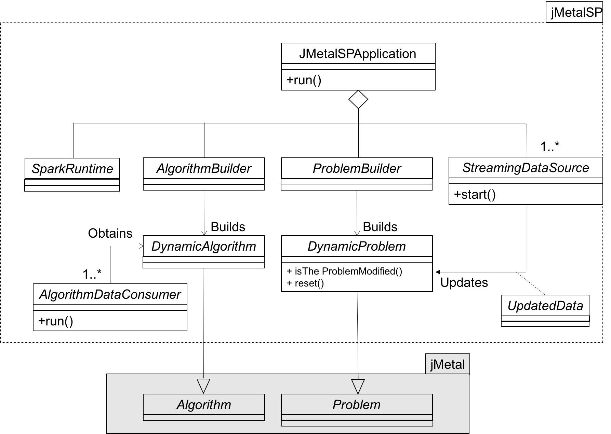
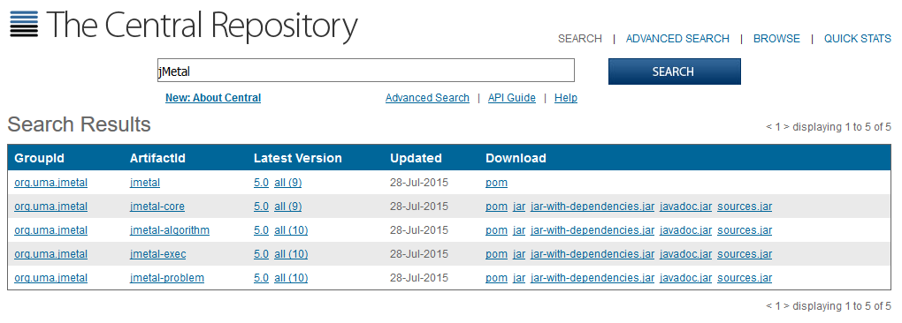
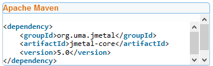

# jMetalSP: A framework for Big Data Optimization with multi-objective metaheuristics

**jMetalSP** is a software platform for dynamic multi-objective Big Data Optimization. It combines the features of the [jMetal](http://jmetal.github.io/jMetal/) multi-objective optimization framework with the [Apache Spark](http://spark.apache.org/) cluster computing system. jMetal provides the optimization infrastructure for implementing both the Big Data optimization problems and the dynamic metaheuristic to solve them; Spark allows to manage the streaming data sources, allowing to effectively use the computing power of Hadoop clusters when processing large amounts of data.

## Architecture
The architecture of jMetal is depicted in the following UML class diagram:



A `jMetalSPApplicatin` is composed of: 
* An instance of the`ProblemBuilder` class, which creates an instance of the `DynamicProblem` to be solved.
* An instance of the`ProblemBuilder` class to create the `DynamicAlgorithm`.
* One or more `StreamingDataSource` objects, which process the incoming data and as a result they change make some change in the `DynamicProblem`.
* One or more `AlgorithmDataConsumer` objects, which receive the results being generated by the `DynamicAlgorithm`.
* One `SparkRuntime` object to configure Apache Spark.

## This site is under construction

It will contain the sources of the jMetalSP project that have been used in these works:
* José A. Cordero, Antonio J. Nebro, Juan J. Durillo, José García-Nieto, Ismael Navas-Delgado, José F. Aldana-Montes: "Dynamic Multi-Objective Optimization With jMetal and Spark: a Case Study". Accepted in MOD 2016.
* Cristóbal Barba-González, Antonio J. Nebro, José A. Cordero, José García-Nieto, Juan J. Durillo, Ismael Navas-Delgado, José F. Aldana-Montes. "JMetalSP: a Framework for Dynamic Multi-Objective Big Data Optimization". Submitted to Applied Soft Computing.

## MOD 2016 Problem

### Introduction

This section will include all the needed documentation to understand and reproduce the results for the problem used in the work "Dynamic Multi-Objective Optimization With jMetal and Spark: a Case Study". Accepted in MOD 2016.

### Requirements

Note: All the work was done using the versions stated below. We cannot guarantee the correct behaviour with newer of future versions.

* `jMetal 5.1-SNAPSHOT` - the current development version of jMetal framework which can be found here: [https://github.com/jMetal/jMetal](https://github.com/jMetal/jMetal)
* `jMetalSP 1.0` - which can be downloaded directly cloning the current repository.
* `Apache Spark 1.6.1` - http://spark.apache.org/downloads.html
* `Apache Maven 3.3.9` - https://maven.apache.org/download.cgi
* `Java Development Kit 7` or newer - http://www.oracle.com/technetwork/es/java/javase/downloads/jdk7-downloads-1880260.html

### Installation

First dependencies that should be installed are (preferably in the following order):

* `Java Development Kit 7`
* `Apache Maven 3.3.9`
* `Apache Spark 1.6.1`

#### jMetal

There are 3 different ways to get jMetal 5.1-SNAPSHOT:

<!--- * It can be found in the [Central Repository](http://search.maven.org/):
#
-->

Add a Maven dependence. For example, if your want to use some of the classes in `jmetal-core`, you just have to add this dependence to the `pom.xml` file of your project:  
<!--- # -->
```
<dependency>
  <groupId>org.uma.jmetal</groupId>
  <artifactId>jmetal-core</artifactId>
  <version>1.0-SNAPSHOT</version>
</dependency>
```

* Download directly from the main website [https://github.com/jMetal/jMetal](https://github.com/jMetal/jMetal).

* Use git to clone its repository:
```
git clone https://github.com/jMetal/jMetal.git
```

Once you have the source code, you use you favourite IDE to import (Eclipse) or open (Intellij Idea) the project as a Maven project, or merely open it (Netbeans).

#### jMetalSP

jMetalSP can be obtained also cloning the current repository:
```
git clone https://github.com/jMetal/jMetal.git
```
jMetalSP 1.0 is structured in three submodules:

* `jmetalsp-core` : Classes of the core architecture plus utilities.
* `jmetalsp-algorithm` : Implementations of metaheuristics.
* `jmetalsp-application` : Implementations of problems, like the used in MOD2016.

### New York's Traffic Data

This work uses the information provided by the traffic cameras installed in the city of New York, which provide real-time information about the status of the traffic in the main roads of the city.

Link to data:
* [1] http://207.251.86.229/nyc-links-cams/LinkSpeedQuery.txt  
  
More information:
* https://data.ny.gov/Transportation/Real-Time-Traffic-Speed-Data/xsat-x5sa
* http://nyctmc.org/
 
This data consists in a row per traffic camera, each column has a different meaning, but we are only using a few of them:
* `ID`: An identifier for each camera.
* `Speed`: Average speed of the traffic in this road.
* `TravelTime`: Average time of the cars in this road.
* `Status`: Status of the road.
* `DataAsOf`: Timestamp of the data.
* `LinkPoints`: List of the GPS coordinates of this path, separated by commas. However this data is not always complete as it seems to be a limit in the number of characters of the field.
* `EncodedPolyline`: The list of GPS coordinates, but encoded using the Google Encoded Polyline Format (https://developers.google.com/maps/documentation/utilities/polylinealgorithm). This format allows to include all the points encoded in a smaller string. The decoding is made in the class `org.uma.jmetalsp.application.biobjectivetsp.runner.mod2016.newyorktraffic.data.GoogleDecode`. The list of coordinates is used to generate the nodes and edges of the graph.
* `LinkName`: Name of the address of the camera.

### Generate the input files for the problem

Once all the dependencies are satisfied you should be able to execute with Java the class `org.uma.jmetalsp.application.biobjetivetsp.runner.mod2016.newyorktraffic.ParseLinkSpeedQuery`, providing two arguments with the paths where the initial problem will be generated, and the updates.

For example:
```
spark-submit --class org.uma.jmetalsp.application.biobjectivetsp.runner.mod2016.newyorktraffic.ParseLinkSpeedQuery --master local[1] jmetalsp-application-1.0-SNAPSHOT-jar-with-dependencies.jar ./nyfiles/initial.txt ./nyfiles/update?.txt
```

This program will connect automatically to the URL[1], parse the data which is updated regularly, and output the following files:

* `Initial file`: The first argument will be the path where the initial file will be generated. This file includes all the needed information to generate the problem. The first line of the file set the number of nodes, the rest of the file contains one row per node, with the following columns:
    * `Node position`: An identifier of the position of each node.
    * `Destination ID`: The identifier of the ending node of this path.
    * `Distance`: The distance of the path between both nodes (see note below).
    * `Speed`: The average travel time for this path.
    * `Node ID`: An identifier of the path.

- Note about the distance: The distance was originally obtained calling the `Google Maps Distance Matrix API` (https://developers.google.com/maps/documentation/distance-matrix/intro). However, as the free account allows only a limited number of queries and the distances will never vary, the distances have been hardcoded directly in the file. If you want to use it with a different dataset please be sure to remove the distances and add your own Google Key in the class `org.uma.jmetalsp.application.biobjectivetsp.runner.mod2016.newyorktraffic.data.GoogleDecode`.
 
* `Update file`: The second argument is the path to generate the updates. Each several seconds the program will get the updates from the traffic and parse them again generating a new file which will include the differences in time and distance.  
The files with the updates can be preserved using the character `?` in any part of the name to be replaced by the number of the update. For example, the path `./nyfiles/updates/update?.txt` will generate the files:
    * `./nyfiles/updates/update1.txt`
    * `./nyfiles/updates/update2.txt`
    * `./nyfiles/updates/update3.txt`
    * ...
If the question mark character is not included, the file will be replaced in each iteration.

### Run the algorithm and solve the problem

Now everything is prepared to run the problem and get the results using the real-time data parsed by the `ParseLinkSpeedQuery` class. The class to be executed is `org.uma.jmetalsp.application.biobjectivetsp.runner.mod2016.MOD2016Runner`, which has 3 parameters:

* `Initial file`: the same initial file generated by `ParseLinkSpeedQuery`.
* `Updates directory`: the path to the directory where the updates are generated by `ParseLinkSpeedQuery`.
* `Output directory`: the path to the directory where the output files will be saved.

### Understanding the results

The algorithm will generate 100 different results for the problem in each iteration.  
Each iteration will generate the two files stated below in the output directory, where the question mark will be replaced by the number of iteration:
* `FUN?.tsv`: Each line contains the cost (time) and distance of each solution, one per line.
* `VAR?.tsv`: Each line contains one solution to the problem, represented as the list of nodes that forms the path.
