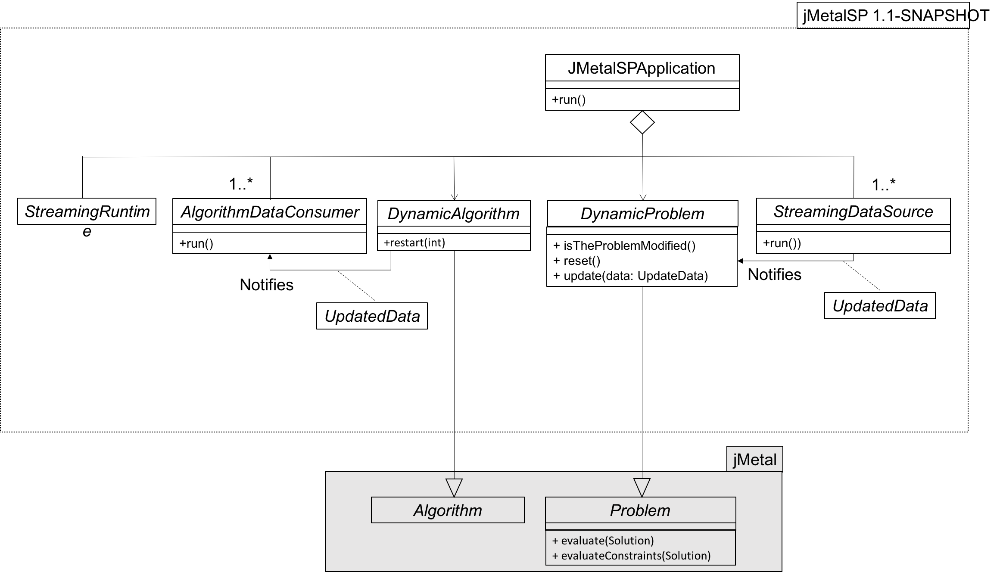

# jMetalSP: A framework for Big Data Optimization with multi-objective metaheuristics

**jMetalSP** is a software platform for dynamic multi-objective Big Data Optimization. It combines the features of the [jMetal](http://jmetal.github.io/jMetal/) multi-objective optimization framework with the [Apache Spark](http://spark.apache.org/) cluster computing system. jMetal provides the optimization infrastructure for implementing both the Big Data optimization problems and the dynamic metaheuristic to solve them; Spark allows to manage the streaming data sources, allowing to effectively use the computing power of Hadoop clusters when processing large amounts of data.

Please, note that jMetalSP is a project in continuous development. If you have any question or suggestion of desirable features to be included, feel free to contact us. 

## Current status
We are currently working on a redesign of the framework with the following ideas in mind:
* Spark is incoupled in a separate module, so users only interested in non-Big Data dynamic optimization problems can use the core of jMetal without Spark.
* The architecture is being refactored:
 * The have introduced the observer pattern to link the stream data sources and algorithm outputs (the observables) with the problems and data consumers (the observers).
 * Unnecessary classes (i.e. problem and algorithm builders) have been removed.
 * Two different runtime systems can be used: plain Java and Java+Spark.
* We are refactoring the example published in the MOD 2016 paper becase the original Web service to obtain traffic data has changed. 
* Algorithms included: dynamic versions of NSGA-II, MOCell and SMPSO
* Problems included: bi-objective TSP, FDA problems.


## Architecture
The architecture of the current development version of jMetalSP (Version 1.1) is depicted in the following UML class diagram:



A `jMetalSPApplication` is composed of: 
* An instance of the `DynamicProblem` class (the problem to be solved).
* An instance of the `DynamicAlgorithm` class (the algorithm to use).
* One or more `StreamingDataSource` objects, which process the incoming data and as a result they change make some change in the `DynamicProblem`.
* One or more `AlgorithmDataConsumer` objects, which receive the results being generated by the `DynamicAlgorithm`.
* A `StreamingRuntime` object to configure the streaming engine.

The implementation of jMetalSP applies Java generics to ensure that all the componentes are compatible. The declaration of the [`jMetalSPApplication`](https://github.com/jMetal/jMetalSP/blob/master/jmetalsp-core/src/main/java/org/uma/jmetalsp/JMetalSPApplication.java) class and its main componentes is the following:
```java
public class JMetalSPApplication<
    D extends UpdateData,
    P extends DynamicProblem<? extends Solution<?>, D>,
    A extends DynamicAlgorithm<?, D>, S extends StreamingDataSource<D,?>> {

  private List<S> streamingDataSourceList ;
  private List<AlgorithmDataConsumer> algorithmDataConsumerList ;
  private StreamingRuntime streamingRuntime ;

  private P problem ;
  private A algorithm ;
  public 
  ...
}
```
This way, by using generics the Java compiler can check that all the components fit together. 

## Examples
The following example applications are included in the current development version:
* [`DynamicContinuousApplication`](https://github.com/jMetal/jMetalSP/blob/master/jmetalsp-examples/src/main/java/org/uma/jmetalsp/examples/continuousproblemapplication/DynamicContinuousApplication.java). Example of using NSGA-II, MOCell or SMPSO to solve the FDA problems using the default streaming runtime, i.e. without Spark
* [`DynamicTSPApplication`](https://github.com/jMetal/jMetalSP/blob/master/jmetalsp-examples/src/main/java/org/uma/jmetalsp/examples/dynamictsp/DynamicTSPApplication.java). Example of using NSGA-II or MOCell or SMPSO to solve a bi-objective TSP problem using the default streaming runtime, i.e. without Spark. The streaming data source simulates changes in the cost matrix (no external data source is used). This is a simplied version the algorithm presented in MOD 2016.
* [`NSGAIIRunner`](https://github.com/jMetal/jMetalSP/blob/master/jmetalsp-spark/src/main/java/org/uma/jmetalsp/spark/evaluator/NSGAIIRunner.java). This example, included in the paper to be presented in EMO 2017, shows how to configure the standard NSGA-II algorithm to solve a modified version of the ZDT1 problem using the Spark evaluator to evaluate the solutions of the population in parallel. 

## Requirements
To run the examples that do not use Spark you need:
* Java JDK 8
* Apache Maven

To execute the codes with Spark:
* Spark 2.0.0 or later

## References
* José A. Cordero, Antonio J. Nebro, Juan J. Durillo, José García-Nieto, Ismael Navas-Delgado, José F. Aldana-Montes: "Dynamic Multi-Objective Optimization With jMetal and Spark: a Case Study". MOD 2016 ([DOI](http://dx.doi.org/10.1007/978-3-319-51469-7_9)).
* Cristóbal Barba-González, José García-Nieto, Antonio J. Nebro and José F. Aldana-Montes. Multi-Objective Big Data Optimization with jMetal and Spark. To be presented in EMO 2017 ([DOI](http://dx.doi.org/10.1007/978-3-319-54157-0_2)).
* Cristóbal Barba-González, Antonio J. Nebro, José A. Cordero, José García-Nieto, Juan J. Durillo, Ismael Navas-Delgado, José F. Aldana-Montes. "JMetalSP: a Framework for Dynamic Multi-Objective Big Data Optimization". Submitted to Applied Soft Computing.

